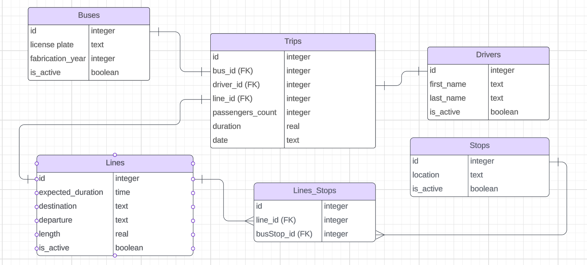

# Federal District's Public Bus Transport Database

By Lurian

Video overview: <https://youtu.be/omfoBl097wA>

## Scope

This is a database for tracking buses' lines, stops and trips at Federal District, in Brazil. The scope of this database includes:

- Basic informations about buses, such as license plate, driver and year of fabrication, for example.  
- Information about the drivers, such as first and last names.
- Information about bus stops and the number of passengers that have entered the bus during a trip.
- Location of bus stops
- Expected duration of lines' trip.
- Trips, including the starting point and the destination, time duration and length.

This database does not include buses that are not part of the public transport system and information about the passengers of each trip.
  
## Functional Requirements

A user should be able to:

- Perform CRUD operations
- Retrieve informations about a specific bus
- Check bus stops and destinations
- Check the expected duration of each line trip
- Get the departure, destination and length of each line
- Check the real time taken by a line in a trip     

The system will not support permanent deletion of data, since its records must be preserved for future supervisions.

## Representation

### Entities

The entities are described as follows:

#### Bus

* `id`, representing the id of each bus
* `license_plate`, wich represents the license plate of the bus
* `fabrication_year`, that represents the year in wich the bus was fabricated
* `is_active`, that indicates if the bus is still being used

#### Line

* `id`, representing the id of each bus
* `expected_duration`, representing the expected duration in minutes of a trip from the departure location of the line to the final destination of the line (seconds are not considered)
* `destination`, representing the final destination of the line
* `departure`, representing the departure location of the line
* `length`, representing the length of the line,in kilometers
* `is_active`, that indicates if the line is still active

#### Trip

* `id`, representing the id of each trip
* `bus_id`, representing the id of the bus used in this trip
* `driver_id`, representing the id of the driver of the trip
* `line_id`, representing the id of the line of this trip
* `passenger_count`, representing the number of passengers that have embarked on the bus during the trip
* `duration`, representing the duration of the trip in minutes (seconds are not considered)
* `departure_datetime`, representing the date and time of departure in the format "YYYY-MM-DD hh:mm:ss"
 
#### Driver

* `id`, representing the id of each driver
* `first_name`, representing the first name of the driver
* `last_name`, representing the last name of the driver
* `is_active`, that indicates if the driver is still active

#### Stop

* `id`, representing the id of the bus stop
* `location`, representing the location of the bus stop
* `is_active`, wich indicates whether the bus stop is active or not

#### Line_Stop

* `id`, representing the id of the line that stops at a specific bus stop
* `line_id`, representing the id of the line
* `busStop_id`, representing the id of the bus 

### Relationships

The diagram of the database is as follows:

## Optimizations

In this section you should answer the following questions:

* `ActiveStops`, `ActiveBuses` and `ActiveLines` views, to filter only active records
* `DeleteStops`, `DeleteBuses`, `DeleteLines` triggers for soft deletion.
* `bus_index` and `lines_index` indexes for indexing the most used coluns on the `Trips` table.

## Limitations

The database may not represent the location of stops without name, wich makes more difficult to represent the route of a specific line precisely. 

The number of passenger that embark and leave the bus at each stop is not represented, as well as their identities.